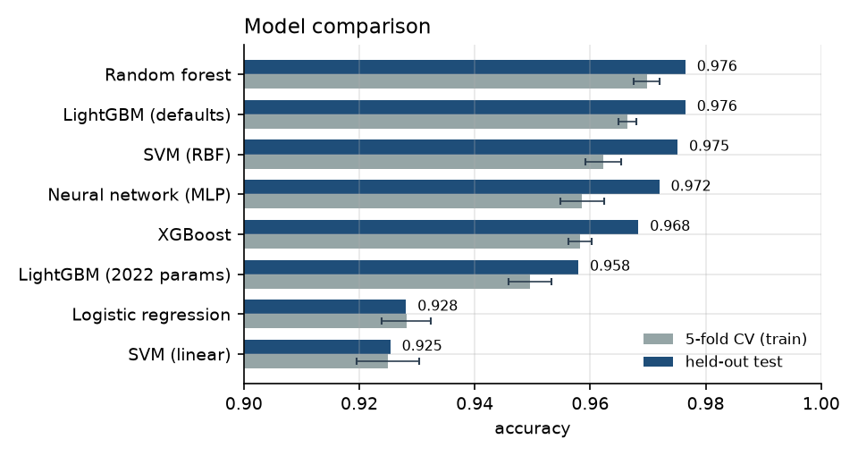
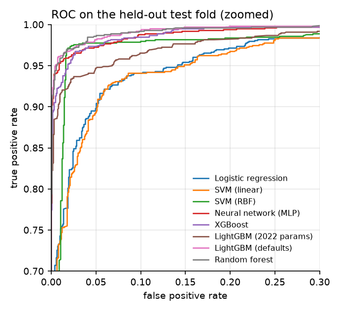
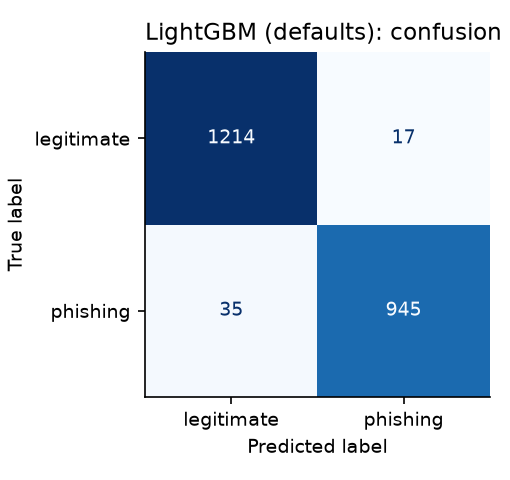
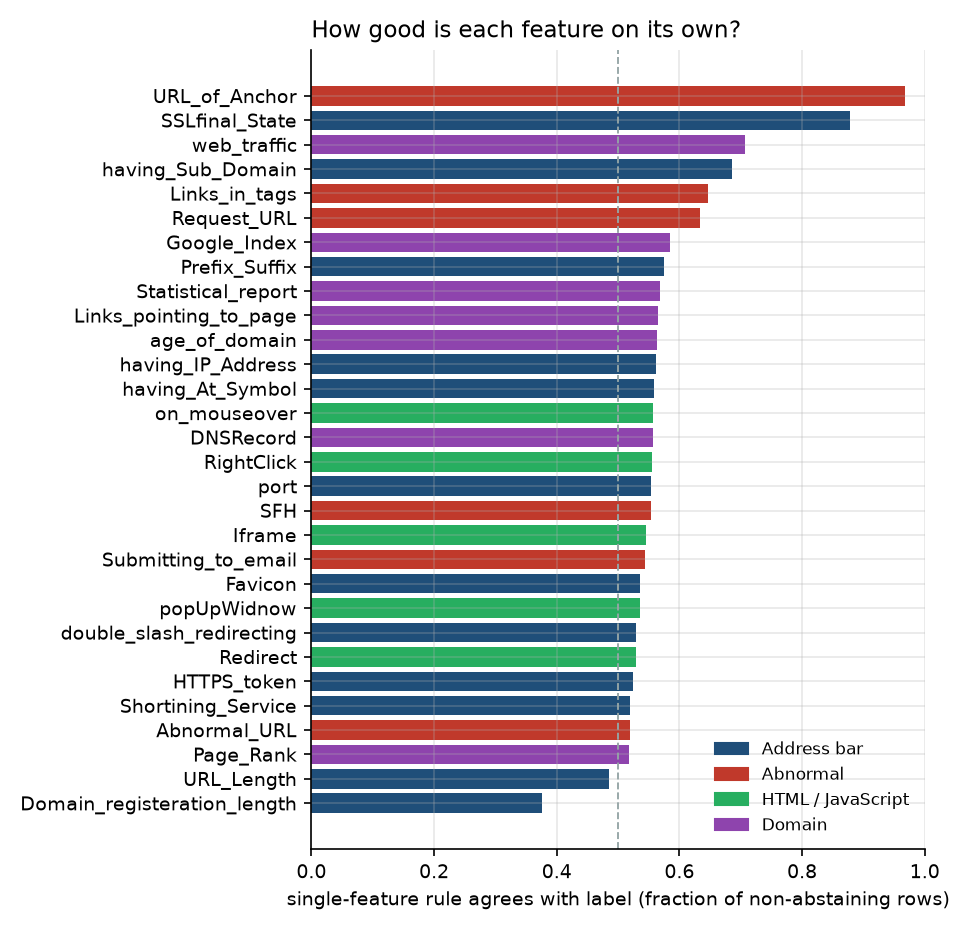
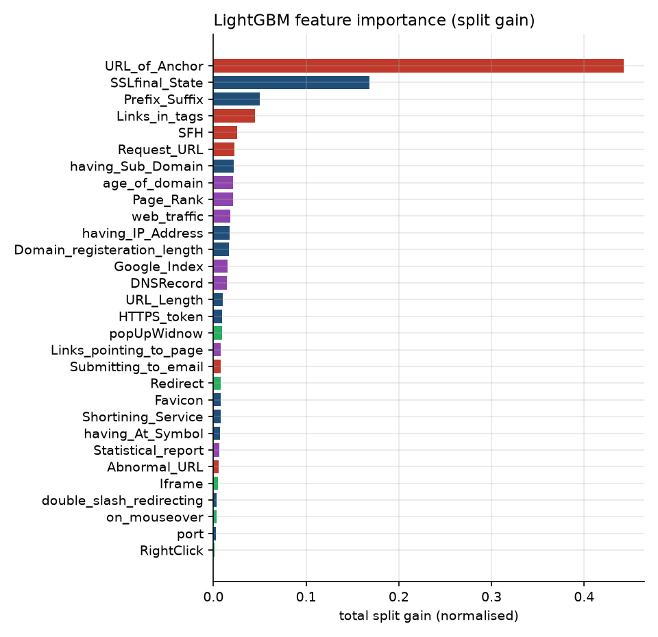
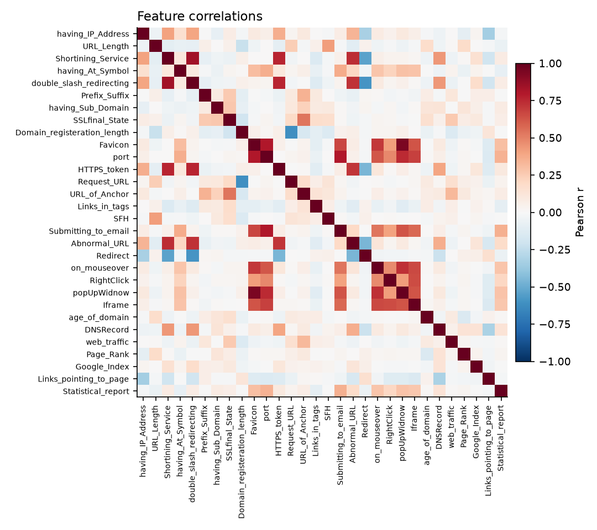

# phishing-detection

[](https://github.com/specialone0007/detectingPhishingWebsites/actions/workflows/ci.yml)


Phishing-website classification on the **UCI Phishing Websites** dataset (11,055 sites, 30
hand-crafted URL/HTML/domain features). A small, tested Python package: data loader with
caching, model-free feature analysis, eight classifiers behind one interface, and an evaluation
protocol that keeps the test fold untouched until the end.

Started as a Sabancı University CS525 (Data Mining) project in 2022; rewritten in 2026 from the
16-page report (kept in [`docs/legacy/`](docs/legacy/)) into a tested package with a stricter
evaluation protocol and updated results.

**[Read the report (PDF, 8 pages)](docs/report.pdf)** — dataset and feature analysis, evaluation
protocol, results for eight classifiers, and what changed since the 2022 study. Source in
[`docs/report.md`](docs/report.md).



## Results

Stratified 80/20 hold-out (8,844 train / 2,211 test), seed 42. CV numbers are 5-fold on the
training part only. "Positive" = phishing.

| model | 5-fold CV acc | test acc | precision | recall | F1 | ROC-AUC | fit |
|---|---:|---:|---:|---:|---:|---:|---:|
| Random forest (500 trees) | 0.970 ± 0.002 | **0.977** | 0.980 | 0.966 | 0.973 | 0.997 | 1.0 s |
| LightGBM (library defaults) | 0.966 ± 0.002 | **0.977** | 0.981 | 0.964 | 0.973 | 0.996 | 0.4 s |
| SVM, RBF kernel | 0.962 ± 0.003 | 0.975 | 0.978 | 0.965 | 0.972 | 0.987 | 12 s |
| Neural network (MLP 64-64-32) | 0.959 ± 0.004 | 0.972 | 0.988 | 0.948 | 0.968 | 0.995 | 1.8 s |
| XGBoost (2022 params) | 0.958 ± 0.002 | 0.968 | 0.970 | 0.958 | 0.964 | 0.995 | 0.4 s |
| LightGBM (2022 params) | 0.950 ± 0.004 | 0.958 | 0.969 | 0.935 | 0.952 | 0.990 | 1.2 s |
| Logistic regression | 0.928 ± 0.004 | 0.928 | 0.934 | 0.901 | 0.917 | 0.979 | 0.0 s |
| SVM, linear kernel | 0.925 ± 0.005 | 0.925 | 0.934 | 0.895 | 0.914 | 0.977 | 2.5 s |

Full table: [`results/model-results.csv`](results/model-results.csv).

Three things worth saying out loud:

- **Stricter protocol, updated headline.** The 2022 study reported LightGBM at 0.98 on its
  development split. Under the new protocol (select on 5-fold CV, report on an untouched
  hold-out) LightGBM with library defaults reaches 0.977 and ties for first; the 2022 tuned
  configuration, which was chosen for a different split, lands at 0.958. The hold-out number is
  the one to quote.
- **Non-linear beats linear by ~5 points**, and the non-linear models are within one point of
  each other. A hard core remains: 22 test sites (1.0 %) are misclassified by all five
  non-linear models. 20 of the 22 are phishing sites, and 19 of them carry a valid SSL state
  and only a "suspicious" (0) anchor score, i.e. they look legitimate on exactly the two
  features the models lean on.
- **Two features do most of the work.** `URL_of_Anchor` alone agrees with the label on 97 % of
  the rows where it does not abstain; `SSLfinal_State` on 88 %. LightGBM assigns them 44 % and
  17 % of total split gain. Most of the 30 features are individually no better than a coin flip.

| ROC (zoomed) | Best model, confusion matrix |
|---|---|
|  |  |

## Feature analysis

Each feature already encodes a rule of thumb from Mohammad, Thabtah & McCluskey: -1 means
"looks like phishing", 1 "looks legitimate", 0 "suspicious / abstain". The left plot asks how
often that rule alone is right; the right plot shows what the gradient-boosted trees actually
used.

| Single-feature agreement with the label | LightGBM split gain |
|---|---|
|  |  |

Strongly correlated pairs (|r| > 0.5) are listed in
[`results/high-correlations.csv`](results/high-correlations.csv); the HTML/JavaScript block
(`Favicon`, `popUpWidnow`, `port`, `on_mouseover`, `Iframe`, `Submitting_to_email`) is nearly
one feature. Tree models do not mind; the linear models would benefit from dropping half of it.



## Layout

```
src/phishing/
  data.py       download + cache the UCI ARFF, validate, map Result → is_phishing, split
  features.py   class balance, single-feature agreement, correlations
  models.py     MODELS: name → estimator factory (sklearn-compatible, seeded)
  evaluate.py   CV on train, one fit, metrics on test → Result dataclass
  plots.py      every figure in docs/figures/
  cli.py        `phishing-experiments`: runs the whole study
tests/          17 tests; synthetic data so CI needs no network
results/        CSVs written by the CLI
docs/figures/   PNGs written by the CLI
docs/legacy/    the 2022 report (PDF)
data/           dataset cache (git-ignored, downloaded on first run)
```

## Run it

```bash
pip install -e ".[dev]"
pytest                    # 17 tests, ~3 s
phishing-experiments      # downloads the dataset once, trains 8 models, writes results/ and docs/figures/
phishing-experiments --models logistic random_forest --seed 7   # subset, other seed
```

Or from Python:

```python
from phishing import load_dataset, train_test, make_model

df = load_dataset()                      # 11,055 × 31, is_phishing ∈ {0, 1}
X_tr, X_te, y_tr, y_te = train_test(df)
clf = make_model("lightgbm_default").fit(X_tr, y_tr)
print(clf.score(X_te, y_te))             # 0.9765
```

## Dataset and label convention

UCI ML Repository id 327, *Phishing Websites* (Mohammad, Thabtah & McCluskey). Downloaded from
`archive.ics.uci.edu` and cached as `data/phishing_websites.csv`. The `Result` column uses
-1 for phishing and 1 for legitimate, the same polarity as every feature. To keep that
convention unambiguous, the package maps it once, in the loader, to `is_phishing` ∈ {0, 1}, so
"positive" means "phishing" in every metric and figure.

## License

MIT. 2022 project by Nasim Tavakkoli, Furkan Reha Tutaş and Melis Tuvana Sarıoğlu
(CS525, Sabancı University). 2026 rewrite by Furkan Reha Tutaş.
